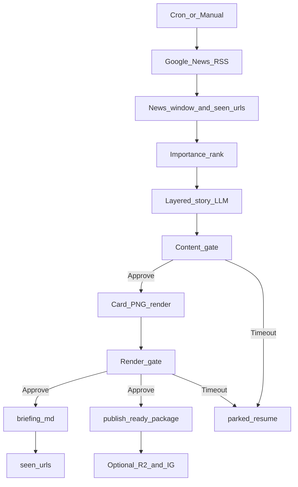

# 01. 개요 · 아키텍처

## 목표

매일 장전(`config/ops.json` `run_at`, 기본 평일 **06:00** `timezone`. Wave 1: 승인 게이트 없이 패키지만 생성, 인스타 실게시 없음. 알림은 `notify_at`. **08:00–09:00** 포스팅은 이후 단계 목표)에 한국 경제·시사 뉴스를 골라 요약하고,

1. **마크다운**으로 “오늘의 경제 브리핑” 장문 초안 (`briefing.md` → 블로그에 수동 붙여넣기)
2. **인스타그램**에 5~7장 카드뉴스 캐러셀 (선택)

을 발행합니다.

## 일일 산출물

| 채널 | 형식 | 내용 |
|------|------|------|
| 블로그 마크다운 | `.md` 장문 | 제목 + 도입 + 핵심 뉴스 약 5건 요약 + 오늘 포인트 + 출처 + 면책 |
| 인스타그램 | 캐러셀 | 표지 → 뉴스 슬라이드 → CTA/면책 |
| (내부) | `final/publish_ready/` | PNG·캡션·manifest — 나중에 CLI/n8n으로 Graph 게시 |

## 운영 원칙

1. **1단계 (`MVP_MODE=draft`)**: Discord/Telegram/Slack에서 **내용 게이트 → 렌더 게이트** Approve 후에만 `briefing.md`(+선택 R2/IG) 발행
2. **2단계(안정화 후)**: 승인 생략 — `MVP_MODE=publish`는 채널 Approve를 **우회**하고 바로 `briefing.md`를 쓰며, **성공 알림은 그대로 보낸다**
3. 원문 복붙 금지. 요약·해설만. 출처 링크 필수
4. 종목 매수/매도·목표가·수익률 보장 문구 금지

## 콘텐츠 톤

- 주식·경제에 관심 있는 개인 투자 브리핑
- 짧고 명확한 한국어
- 카드 슬라이드 본문은 **최대 2줄** (`one_liner` 우선) — 상세 계약은 [03. LLM·프롬프트](03-llm-and-prompts.md)
- 인스타 게시글 본문: 훅 + 오늘의 포인트 + 면책 + 해시태그 (`scripts/cards`)

## 대상 독자 (콘텐츠)

- 장전/장중에 “오늘 뭐가 중요하지?”를 빠르게 보고 싶은 개인 투자자
- 네이버 포털면 그 자체가 아니라, **시장·정책에 영향 큰 이슈** 위주

---

## 사람 · AI · 바이브코딩 (역할)

이 프로젝트는 **운영자(사람)의 기획·결정·검수** 위에, AI·바이브코딩을 **도구**로 써서 구현·문서·테스트를 보조한 형태입니다. A–Z를 AI가 단독으로 기획·결정한 프로젝트가 아닙니다.

| 역할 | 담당 |
|------|------|
| **운영자(사람)** | 제품 목표·범위·톤, 채택/기각 결정, Approve·채널·자격증명 검수, 로컬/실서비스 운영 |
| **AI · 바이브코딩** | 코드 초안·리팩터, 단위 테스트·문서 초안, 조사·초안 보조. 최종 채택과 운영 책임은 운영자에게 있음 |

---

## 파이프라인

실행 본체는 **호스트 Python** (`scripts/mvp_pipeline.py`). n8n은 후속 오케스트레이션 옵션입니다.

## 프로세스 구성

| 구성요소 | 실행 위치 | 역할 |
|----------|-----------|------|
| n8n | Docker | 스케줄, HTTP/RSS, 분기, 알림 (후속) |
| Postgres | Docker | `seen_urls` |
| Browserless | Docker | 카드 HTML → PNG |
| Ollama | Docker | 중요도·스토리/브리핑 |
| Cloudflare R2 | 클라우드 | 인스타용 공개 이미지 URL |
| Instagram Graph | 클라우드 | 캐러셀 게시 |

같은 Compose 네트워크에서 n8n → `http://ollama:11434`.  
호스트 스크립트는 `OLLAMA_HOST_URL`(`http://127.0.0.1:11434`).  
기존 Ollama 컨테이너만 쓸 때는 이 프로젝트 `ollama` 서비스를 끄고 URL만 맞춥니다 (포트 `11434` 충돌 주의).

## 기술 스택과 설계 결정

| 영역 | 선택 | 이유 |
|------|------|------|
| 오케스트레이션 | Python MVP (+ n8n 후속) | 로컬에서 바로 실행 가능 |
| 뉴스 목록 | Google News KR 토픽 RSS | 키 없이 RSS, 연동 단순 |
| LLM | Ollama (Docker) | 비용·프라이버시 |
| 블로그 | 마크다운 반자동 | Open API 종료 → 수동 붙여넣기 |
| 카드 채널 | Instagram Graph API | 비즈니스/크리에이터 + 연결 Facebook Page · long-lived 토큰 · `instagram_content_publish`(Facebook Login for Business) 또는 `instagram_business_content_publish`(Business Login for Instagram); 필요 시 `pages_read_engagement` |
| 카드 이미지 | HTML + Browserless | 한글 타이포·레이아웃 통제 |
| 이미지 호스팅 | Cloudflare R2 | Media API는 공개 HTTPS URL 필요 |
| 승인 | Discord(주력) / Telegram / Slack | 이미지 확인 후 Approve |

## 의도적으로 미룬 것 (Phase 2+)

- 네이버 뉴스 섹션(`101`/`102`) 스크래핑
- 언론사·네이버 기사 본문 HTML 파싱
- 실제 조회수/랭킹 페이지 기반 정렬
- 클라우드 LLM 폴백

다음: [02. 뉴스 수집](02-news-collection.md)
