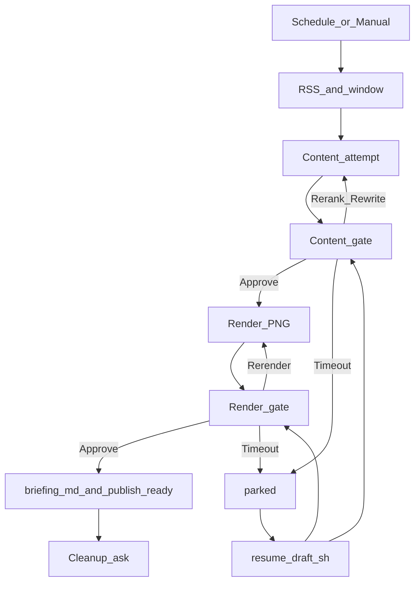

# 04. 발행 · 워크플로

> 티스토리 Open API는 2024년 종료되었습니다. 블로그 발행은 **마크다운 파일 수동 붙여넣기**로 합니다.

실행 본체는 **호스트 Python**입니다.

```bash
uv sync
MVP_MODE=draft uv run python scripts/mvp_pipeline.py
# 또는
./scripts/run_draft.sh
```

n8n UI 네이티브 워크플로(`workflows/econ-briefing-daily.json`)는 **후속**입니다.  
스케줄은 cron + `scripts/cron_run_draft.sh` / `run_draft.sh`를 권장합니다.  
설치·실행 절차: [00. MVP 빠른 시작](00-mvp-quickstart.md).

---

## Draft 순서 (2단계 게이트)



| # | 단계 | 역할 |
|---|------|------|
| 1 | Schedule / Manual | 평일 아침 등 |
| 2 | Google News RSS | BUSINESS + NATION |
| 3 | 창 필터 | `NEWS_WINDOW_MODE=since_prev_day_hour` (전일 15:00~now, KST) |
| 4 | Postgres `seen_urls` | 이미 쓴 URL 제외 |
| 5 | Content loop | Ollama 랭킹+layered story → `attempts/content-NN/` |
| 6 | ① 내용 게이트 | 텍스트만. ✅ Approve / 🔀 Rerank / ✍️ Rewrite (`CONTENT_RETRY_MAX`) |
| 7 | Render loop | 선택 `briefing.json` → `renders/render-NN/cards/` PNG + `renders/render-NN/infographic/` |
| 8 | ② 렌더 게이트 | 이미지 확인 (인포그래픽이 카드보다 먼저). ✅ Approve / 🔁 Re-render (`RENDER_RETRY_MAX`) |
| 9a | Approve | `briefing.md` + `infographic.png` 저장 (블로그 수동 붙여넣기) |
| 9b | Postgres | **즉시** `seen_urls` insert (알림·IG 실패와 무관; 기록 삭제 없음) |
| 9c | `PUBLISH_CARDS=1` | 동일 PNG → R2 → (`PUBLISH_MODE`) Instagram carousel |
| 9d | `final/publish_ready/` | 카드 PNG·캡션·manifest (나중에 CLI/n8n 게시) |
| 10 | Notify | 결과 / 단계 실패·부분스킵 알림 |
| 11 | ③ Cleanup ask | 확정본만 유지 / 전부 보관. 타임아웃→확정본만 |

Rerank는 이번 run의 이전 content attempt URL을 제외한 뒤 재랭킹한다. Rewrite는 같은 `picked`로 스토리만 재생성한다.  
남은 후보가 없으면 Rerank는 차감 없이 내용 게이트를 다시 띄운다. 재생성 도중 실패하면 차감분도 복구한다.  
재시도 소진 시 `seen_urls` 없이 중단한다.  
내용/렌더 **타임아웃** 시 run을 `parked`로 남기고 `./scripts/resume_draft.sh output/<run_id>`로 이어서 게이트를 연다.

구현: [`scripts/notify/`](../scripts/notify/), [`scripts/draft_run.py`](../scripts/draft_run.py), [`scripts/mvp_pipeline.py`](../scripts/mvp_pipeline.py).

---

## Approve 채널 (`NOTIFY_CHANNEL`)

| `NOTIFY_CHANNEL` | 동작 |
|------------------|------|
| (미설정) | Discord(주력) → telegram → slack → cli |
| `discord` | 단계별 리액션 (내용/렌더/클린업) |
| `telegram` | 인라인 버튼 |
| `slack` | 단계별 리액션 |
| `cli` | 터미널 입력 |
| `auto` | 대기 없이 Approve → keep_final (로컬 스모크) |

공통 타임아웃: `APPROVE_TIMEOUT_SEC` (기본 **3600초**). 만료 N분 전 재알림(`APPROVE_REMINDER_SEC`, 기본 600).

첫 알림 전에 `NOTIFY_SEND_AT`(없으면 `config/ops.json` `schedule.notify_at`)까지 대기합니다. draft는 content 게이트, autonomous는 완료/`ACTION REQUIRED` 알림. 이미 지났으면 바로 보냅니다.

### 미리보기에 포함

- 제목, 시장 한줄, 선정 뉴스, 슬라이드 headline
- **블로그 인포그래픽 + 카드 PNG 첨부** (생성 실패 시 텍스트만 + 경고)
- Approve / Skip 조작법

| 선택 | 동작 |
|------|------|
| Approve (렌더) | `briefing.md` 저장 → **즉시 `seen_urls`** → (선택) R2/인스타 → **md 알림** → cleanup |
| Rerank / Rewrite / Re-render | 해당 단계 재생성 (성공 시에만 기회 차감) |
| 타임아웃 | parked. `seen_urls` 미기록. `resume_draft.sh`로 재개 |
| 횟수 소진 | 중단. `seen_urls` 미기록. `./scripts/run_draft.sh` 재실행 |

`briefing.md` 저장에 성공하면 **알림·인스타보다 먼저** `seen_urls`에 insert합니다. 이후 채널 알림 실패·인스타 실패가 나도 기록은 남고 삭제되지 않습니다.

### Discord 설정 (주력)

1. [Discord Developer Portal](https://discord.com/developers/applications)에서 앱·Bot → `DISCORD_BOT_TOKEN`
2. 권한: `View Channel`, `Send Messages`, `Attach Files`, `Add Reactions`, `Read Message History`  
   (`View Channel`은 채널이 @everyone 등에서 상속하면 초대만으로 충분할 수 있음. 채널 권한을 덮어쓴 경우에는 명시적으로 부여)
3. **텍스트 채널** ID → `DISCORD_CHANNEL_ID` (카테고리 ID 금지)
4. `NOTIFY_CHANNEL=discord`

스모크: `uv run python scripts/smoke_discord.py`  
Telegram: `uv run python scripts/smoke_telegram.py`  
Slack: `uv run python scripts/smoke_slack.py` (`NOTIFY_CHANNEL=slack`)

---

## 반자동 블로그 (Markdown)

| 파일 | 용도 |
|------|------|
| `briefing.md` | 에디터에 붙여넣기 (권장) |
| `briefing.html` | HTML이 필요할 때 |
| `briefing.json` | LLM 원본 구조 |
| `infographic.png` | 썸네일 겸 본문 상단 요약 이미지 (1080×1080) |
| `humanize_result.json` | 한국어 자연화 진단·적용·롤백 기록 |

### 블로그 인포그래픽

렌더 attempt마다 `renders/render-NN/infographic/`에 `infographic.html`과 `infographic.json`(픽토그램 선택 근거)을 만듭니다. `infographic.png`는 PNG 렌더가 성공한 경우에만 생깁니다. 렌더 게이트에서 카드보다 **먼저** 첨부되지만 `card_png_paths`에는 들어가지 않아 캐러셀 장수는 그대로입니다.

Approve하면 승인된 한 장이 run 루트(`briefing.md` 옆)와 `final/infographic.png`로 복사되고 cleanup 후에도 남습니다.

```text
output/<run_id>/
├── briefing.md          # 제목 바로 아래 
├── infographic.png
└── final/
    ├── briefing.md
    ├── infographic.png  # cards/ 밖 — 인스타 패키지에 포함되지 않음
    └── cards/
```

**티스토리 수동 첨부 (현행 유지)**

1. `final/briefing.md`를 티스토리 에디터의 마크다운 모드에 붙여넣습니다.
2. `final/infographic.png`를 제목 바로 아래 이미지 자리에 업로드합니다.
3. 같은 PNG를 대표 이미지(썸네일)로 지정합니다.

인포그래픽 렌더가 실패한 날에는 마크다운에 이미지 링크를 **넣지 않습니다**(깨진 이미지 방지). 카드 렌더와 발행은 그대로 진행됩니다.

템플릿 슬롯·픽토그램 카탈로그: [05. 카드 템플릿](05-card-templates.md#3-블로그-인포그래픽-templatescardsinfographic).

---

## 카드뉴스 / Instagram

카드 슬라이드·인스타 본문 조립: [`scripts/cards/`](../scripts/cards/).  
슬라이드/캡션 **필드 계약**은 [03. LLM·프롬프트](03-llm-and-prompts.md)를 따릅니다.  
번들·에디토리얼 HTML·추가 방법: **[05. 카드 템플릿](05-card-templates.md)**.

| 모듈 | 역할 |
|------|------|
| `CardAssembler` | cover / story / disclaimer 슬라이드 |
| `InstagramCaptionBuilder` | 게시글 본문 + 해시태그 |
| `CardRenderer` | HTML·PNG·caption 파일 |

```bash
uv run python scripts/preview_cardnews.py --list-bundles
uv run python scripts/preview_cardnews.py --bundle editorial_carousel
uv run python scripts/preview_cardnews.py --from-run output/<YYYYMMDD_HHMMSS>
```

### 인스타 게시글 본문

```text
{브랜드} · {YYYY.MM.DD}
{후킹 한 줄}

오늘의 포인트
1) …
2) …

자세한 해설은 프로필 링크·블로그 브리핑에서 이어갑니다.

※ 정보 안내용이며 투자 권유가 아닙니다.

#경제뉴스 #증시 …
```

`full_text`는 Graph API 한도(2100자)에 맞춰 자릅니다.

### 파이프라인 (`PUBLISH_CARDS` / `PUBLISH_MODE`)

- **draft:** ① 내용 Approve 후 ② 렌더 게이트용 로컬 카드 PNG를 채널에 첨부
- 확정 후 `final/publish_ready/`에 PNG·캡션·`publish_manifest.json` 패키지
- **`PUBLISH_CARDS=1`:** 렌더 Approve **후** R2 → (모드에 따라) Instagram
- **`PUBLISH_MODE`:** `publish`(기본) | `package`(Graph 게시는 CLI로 분리)

```bash
uv run python scripts/publish_ready.py publish output/<run_id>
```

### Instagram ‘임시 저장’ / Archive

| 형태 | 가능? | 비고 |
|------|-------|------|
| 앱 Drafts | 불가 | API에 draft 없음 |
| unpublished container | 부분 | `creation_id`, 약 24시간 만료 |
| `final/publish_ready/` | **권장** | PNG + caption + manifest |
| Archive → 다시 표시 | 앱만 | **새 게시 도달 아님**. 임시저장 대용 비추 |

공개 후 Archive했다가 다시 표시해도 팔로워 피드에 ‘새 글’로 재배포되지 않습니다. Graph로 archive/unarchive는 없습니다.

| 모듈 | 역할 |
|------|------|
| `PublishConfig` | `PUBLISH_CARDS`, `PUBLISH_MODE`, R2_*, IG_* |
| `R2Uploader` | PNG → R2 공개 URL |
| `InstagramCarouselPublisher` | children → CAROUSEL → `media_publish` |
| `PublishCardsPipeline` | Approve 후 R2 + 인스타 |
| `publish_ready` | 패키지 write/load + CLI |

```bash
uv run python -m unittest tests.test_instagram_publish tests.test_notify_approve tests.test_run_publish -v
```

---

## `seen_urls`

스키마: [`init/01_seen_urls.sql`](../init/01_seen_urls.sql) · 런타임: [`scripts/seen_urls.py`](../scripts/seen_urls.py)

```sql
CREATE TABLE IF NOT EXISTS seen_urls (
  url_hash CHAR(64) PRIMARY KEY,
  url TEXT NOT NULL,
  title TEXT,
  used_in_run_at TIMESTAMPTZ NOT NULL DEFAULT NOW(),
  tistory_post_id TEXT,
  ig_media_id TEXT
);
```

- 타임아웃/소진 시 미기록; 마크다운 저장 성공 시 insert (`ig_media_id`는 있을 때만)

## 에러 처리

- R2/인스타 실패 → 채널에 단계 알림; 마크다운·`seen_urls`는 유지 가능
- 최상위 예외 → `[경제브리핑 실패] …`

## n8n (후속)

참고 순서: Schedule → RSS → Code → Ollama HTTP → Execute Command(`run_draft.sh`).  
[`code-nodes/`](../workflows/code-nodes/) 샘플의 “당일 캘린더” 필터는 Python MVP의 `since_prev_day_hour`와 **다릅니다**.

다음: [05. 카드 템플릿](05-card-templates.md)
