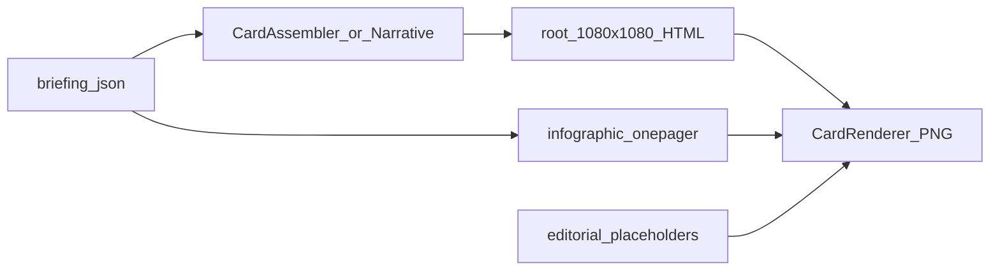

# 05. 카드뉴스 템플릿

인스타그램 캐러셀용 HTML 템플릿과 번들 카탈로그를 정리합니다.  
발행 흐름·캡션 규칙은 [04. 발행·워크플로](04-publishing.md)을 보세요.  
슬라이드 필드 계약은 [03. LLM·프롬프트](03-llm-and-prompts.md)를 따릅니다.

## 한눈에 보기

저장소에는 **서로 다른 렌더 경로**가 세 갈래 있습니다. 이름이 비슷한 HTML이어도 역할이 다릅니다.

| 경로 | 캔버스 | 스타일 | 용도 |
|------|--------|--------|------|
| [`templates/cards/*.html`](../templates/cards/) (루트) | 1080×1080 | 다크 | 파이프라인·내러티브 번들용 단순 슬라이드 |
| [`templates/cards/editorial/`](../templates/cards/editorial/) | 1080×1350 | 라이트·에디토리얼 | **재사용 UI 템플릿** (플레이스홀더만) |
| [`templates/cards/infographic/`](../templates/cards/infographic/) | 1080×1080 | 라이트·요약 | **블로그 인포그래픽 1장** (썸네일 겸 본문 상단) |



```text
templates/cards/
├── cover.html          # 루트 세트 (다크)
├── slide.html
├── disclaimer.html
├── hook.html
├── cta.html
├── editorial/          # 에디토리얼 세트 (라이트)
│   ├── design-system.css
│   ├── 01-hook.html
│   ├── …
│   └── 08-cta.html
└── infographic/        # 블로그 인포그래픽 1장
    ├── design-system.css
    ├── onepager.html
    ├── pictograms.svg
    ├── pictograms.json
    └── ICONS-LICENSE.md
```

번들 메타(장수·역할·추천 주제)는 [`scripts/cards/bundles/*.json`](../scripts/cards/bundles/)에 있습니다.

---

## 1) 루트 템플릿 (`templates/cards/*.html`)

### 파일

| 파일 | 슬라이드 유형 | 역할 |
|------|---------------|------|
| `cover.html` | cover | 표지 (브랜드·날짜·테마) |
| `slide.html` | story 등 | 본문 슬라이드 (라벨·번호·헤드라인·본문) |
| `disclaimer.html` | disclaimer | 면책 |
| `hook.html` | hook | 관심 유도 (다크 Why-Cause 예시용) |
| `cta.html` | cta | 행동 유도 (다크 Why-Cause 예시용) |

### 누가 쓰나

- [`CardTemplateRenderer`](../scripts/cards/renderer.py) — 기본 `templates_dir`이 루트 `templates/cards`
- [`CardAssembler`](../scripts/cards/assembler.py) — `daily_briefing` (cover + stories + disclaimer)
- [`NarrativeAssembler`](../scripts/cards/narrative.py) — `why_cause_impact` 등 내러티브 번들
- [`mvp_pipeline.render_cards`](../scripts/mvp_pipeline.py) — `PUBLISH_CARDS=1` 시 PNG

플레이스홀더: `{{headline}}`, `{{body}}`, `{{brand}}`, `{{index}}`, `{{label}}` (타입에 따라).

### 삭제해도 되나?

**지금 당장 삭제하면 안 됩니다.**  
루트 HTML을 지우면 `daily_briefing` / `why_cause_impact` / 파이프라인 카드 렌더·관련 테스트가 깨집니다.  
에디토리얼만 쓸 계획이면, 해당 경로를 editorial로 이전·테스트 수정한 **뒤에** 정리하세요.

---

## 2) 에디토리얼 UI (`templates/cards/editorial/`)

경제/사회 뉴스용 **재사용 가능한 Instagram 캐러셀 UI**입니다.  
실제 뉴스 문구가 아니라 **슬롯(플레이스홀더)** 만 두어, 나중에 콘텐츠만 갈아끼웁니다.

### 원리 (레이아웃 ↔ 콘텐츠 분리)

```text
design-system.css  +  01~08.html({{슬롯}})  +  content dict
                         ↓
                   완성 HTML × 8
                         ↓
                    PNG × 8 (Chrome/Browserless)
```

1. HTML에 카드·여백·아이콘·차트 **골격** 고정  
2. `{{headline}}`, `{{bullet_1}}` 등 **키만** 치환  
3. 색·타이포·radius는 `design-system.css` 토큰 공유  

구현: [`EditorialCarouselTemplate`](../scripts/cards/editorial.py)  
기본 콘텐츠: `placeholder_content()` (모두 “플레이스홀더” 문구)

### 슬라이드 구성 (8장)

| # | 파일 | 목적 | 레이아웃 요약 |
|---|------|------|----------------|
| 01 | `01-hook.html` | 관심 유도 | 카테고리 라벨 + 큰 헤드라인 + 서브 + 일러스트 카드 |
| 02 | `02-what-happened.html` | 사건 요약 | 제목 + 불릿 3 + 타임라인/뉴스 아이콘 |
| 03 | `03-background.html` | 배경·원인 | 세로 Number Card 3장 (아이콘·제목·한 줄) |
| 04 | `04-analysis.html` | 핵심 분석 | Highlight Box + 불릿 + 우측 막대 차트 |
| 05 | `05-impact.html` | 영향 | Impact Card 2×2 (Consumers/Companies/Investors/Government) |
| 06 | `06-outlook.html` | 전망 | Timeline + Scenario A/B + Flow + Expert |
| 07 | `07-summary.html` | 한 줄 결론 | Quote Card (공유용) |
| 08 | `08-cta.html` | CTA | 로고·Save/Share/Follow·면책 |

### 디자인 토큰

| 토큰 | 값 |
|------|-----|
| Canvas | 1080 × 1350 |
| Margin | 64 px |
| Radius | 20 px |
| Primary | `#163A70` |
| Accent | `#F59E0B` |
| Background | `#F7F8FA` |
| Card | `#FFFFFF` |
| Text | `#1F2937` |
| Secondary text | `#6B7280` |
| Font | Pretendard Bold / Regular |

### 재사용 컴포넌트 (CSS 클래스)

`Info Card` · `Number Card` · `Quote Card` · `Timeline` · `Flow Diagram` · `Statistic Card` · `Impact Card` · `CTA Footer` · `Highlight Box`  
정의: [`design-system.css`](../templates/cards/editorial/design-system.css) + 각 슬라이드 HTML.

### 로컬 미리보기

```bash
uv run python scripts/preview_cardnews.py --bundle editorial_carousel
# → output/cardnews-preview/ (또는 --out 경로)
#    slide-01..08.html/.png
#    placeholders.json, template_meta.json
#    caption.txt, hashtags.txt, instagram_post.txt
```

콘텐츠만 바꿀 때: `placeholders.json`의 키 값을 채운 dict를 `EditorialCarouselTemplate(content=...)`에 넘기면 됩니다. HTML 구조는 수정하지 않아도 됩니다.

---

## 3) 블로그 인포그래픽 (`templates/cards/infographic/`)

브리핑 전체를 **1080×1080 PNG 한 장**으로 요약합니다. 블로그 썸네일과 본문 상단 요약을 겸하며, 인스타 캐러셀과는 별개 산출물입니다(카드 장수·게시 순서에 영향 없음).

### 레이아웃 슬롯

| 영역 | 슬롯 | 내용 |
|------|------|------|
| 헤더 | `brand`, `date`, `kicker` | 브랜드·날짜·고정 라벨 |
| 리드 | `title`, `intro` | 헤드라인 + 도입 한 줄 |
| 대표 신호 3 | `story_N_index/title/body/icon` | stories 앞 3건 (원본 3~5건은 `briefing.md`에 그대로 유지) |
| 영향 4칸 | `impact_N_label/body/icon` | `market_impact` 긍정/중립/부정 + 다음 관전 포인트 |
| 인사이트 | `insight` | 한 줄 마무리 |

모든 슬롯은 HTML escape → 글자 수 제한 → 빈 값이면 `is-empty` 폴백을 거칩니다. 외부 폰트·이미지 URL을 쓰지 않아 Browserless와 로컬 Chrome이 같은 결과를 냅니다.

### 픽토그램 카탈로그

이모지 대신 로컬 SVG sprite를 씁니다. [`pictograms.json`](../templates/cards/infographic/pictograms.json)에 **48종 + `generic` 폴백**이 있고, 각 항목은 `id`·한/영 태그·우선순위를 가지며 [`pictograms.svg`](../templates/cards/infographic/pictograms.svg)의 symbol ID와 1:1로 검증됩니다(테스트가 강제).

| 그룹 | 예시 id |
|------|---------|
| 거시·지표 | `inflation`, `interest-rate`, `exchange-rate`, `economic-indicator`, `employment` |
| 금융·시장 | `stock-market`, `bond`, `bank`, `central-bank`, `fund`, `investment`, `volatility` |
| 정책·제도 | `policy`, `regulation`, `tax`, `budget`, `parliament`, `court`, `government` |
| 산업 | `semiconductor`, `automobile`, `energy`, `shipbuilding`, `steel`, `chemical`, `bio`, `ai`, `telecom` |
| 생활·부동산 | `real-estate`, `housing-lease`, `construction`, `consumer`, `loan`, `payment` |
| 국제·기타 | `global`, `trade`, `tariff`, `oil`, `commodity`, `gold`, `shipping` |
| 방향 | `trend-up`, `trend-down` (기사에 명시적 방향 키워드가 있을 때만) |

선택은 **코드가 결정**합니다. fact-layer LLM은 `visual_tags`로 후보만 제안하고, 카탈로그에 없는 값은 story 실패로 보지 않고 버립니다.

```text
유효한 visual_tags → headline/source 주제어 → one_liner/body → generic
(동점은 카탈로그 priority로 고정)
```

아이콘은 Lucide geometry 관례를 따라 직접 작성했습니다. 출처·라이선스 메모: [`ICONS-LICENSE.md`](../templates/cards/infographic/ICONS-LICENSE.md).

### 렌더 · 산출물

```python
from cards import export_infographic
export_infographic(briefing, render_dir / "infographic", brand="경제 브리핑", date="2026.08.23")
# → infographic.html / infographic.png / infographic.json(선택 근거)
```

파이프라인 경로와 수동 첨부 절차는 [04. 발행·워크플로](04-publishing.md#블로그-인포그래픽)를 보세요.

---

## 4) 번들 카탈로그 (`scripts/cards/bundles/`)

내러티브·운영 템플릿의 **스펙**(장수, role, 추천 주제)을 JSON으로 보관합니다.  
HTML 파일 자체가 아니라 **어떤 슬라이드 순서로 글을 쓸지**에 대한 정의입니다.

| id | 이름 | 장수 | HTML 연동 |
|----|------|------|-----------|
| `editorial_carousel` | 에디토리얼 UI | 8 | `templates/cards/editorial/` |
| `why_cause_impact` | Why→원인→영향→전망 | 8 | 루트 hook/slide/cta 등 |
| `myth_vs_truth` | 오해 vs 진실 | 7 | (스펙만; 전용 HTML 미구현) |
| `five_min_class` | 5분 경제 교실 | 6 | (스펙만) |
| `numbers` | 숫자로 보는 경제 | 6 | (스펙만) |
| `storytelling` | 스토리텔링 경제 | 6 | (스펙만) |
| `daily_briefing` | 오늘의 이슈 브리핑 | 5~7 | 루트 cover/slide/disclaimer |

```bash
uv run python scripts/preview_cardnews.py --list-bundles
```

공통 디자인 메모: [`design_guide.json`](../scripts/cards/bundles/design_guide.json)

---

## 5) 새 템플릿을 추가할 때 (권장)

다른 도구·AI로 UI를 더 만들 경우, **에디토리얼 패턴을 복제**하는 것을 권장합니다.

1. `templates/cards/<새이름>/` 아래에 `design-system.css` + 슬라이드 HTML (슬롯은 `{{key}}`)  
2. `scripts/cards/bundles/NN_<id>.json`에 메타 등록  
3. `EditorialCarouselTemplate`과 같은 방식으로 content dict → HTML 치환 → PNG  
4. `docs/05-card-templates.md`(본 문서)와 [04. 발행·워크플로](04-publishing.md) 표에 한 줄 추가  
5. 루트 `cover.html` 등과 **섞지 말 것** — 캔버스·톤이 다름  

스펙만 있는 번들(`myth_vs_truth` 등)에 HTML을 붙일 때도 동일하게 **전용 디렉터리**를 두는 편이 안전합니다.

---

## 6) 관련 코드·문서

| 경로 | 설명 |
|------|------|
| [`scripts/cards/`](../scripts/cards/) | Assembler / Caption / Renderer / Editorial |
| [`scripts/cards/infographic.py`](../scripts/cards/infographic.py) | 픽토그램 결정 + 인포그래픽 슬롯·PNG |
| [`scripts/preview_cardnews.py`](../scripts/preview_cardnews.py) | 로컬 MVP 미리보기 CLI |
| [`docs/04-publishing.md`](04-publishing.md) | 발행·캡션·`PUBLISH_CARDS` |
| [`docs/00-mvp-quickstart.md`](00-mvp-quickstart.md) | 빠른 실행 |

다음: [06. 로드맵·운영](06-roadmap.md) · [04. 발행·워크플로](04-publishing.md)
